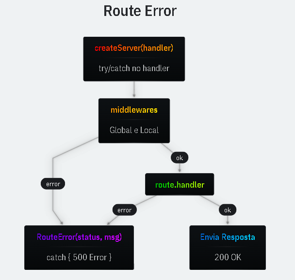

# Route Error

Usamos o route error para erros previstos pelo nosso programa, como usuário não encontrado, dados enviados incorretos, validação de inputs e mais.

- `try/catch`  
  O try/catch no Handler irá lidar com qualquer erro que aconteça nele e nas funções que ele executa (middlewares, handlers)

- `RouteError`  
  Podemos criar um erro específico para facilitar a finalizar de requests.

## Ex.:

```ts
export class RouteError extends Error {
  status: number;
  constructor(status: number, message: string) {
    super(message);
    this.status = status;
  }
}
```

## Uso:

```ts
core.router.get("/curso/:slug", (req, res) => {
  const { slug } = req.params;
  const curso = pegarCurso(slug);
  if (!curso) {
    throw new RouteError(404, "curso não encontrado");
  }
  res.status(200).json(curso);
});
```

# Diagrama do Fluxo:

