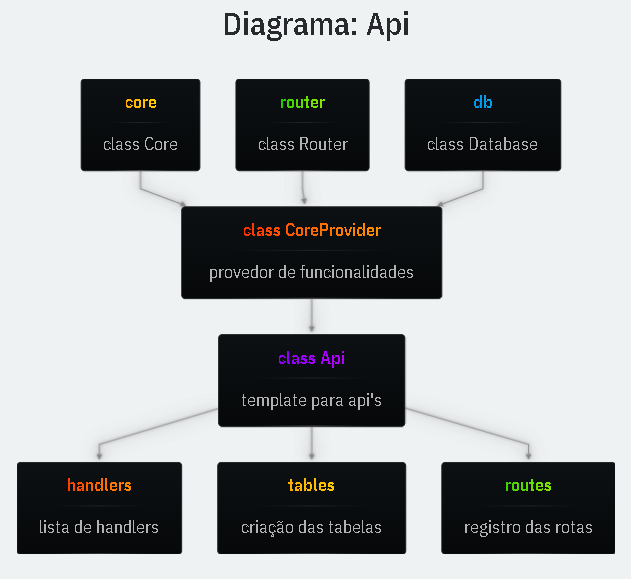

# Core Provider

O Core Provider é uma classe base que facilita o reuso das funcionalidades do `core` em diferentes arquivos/módulos do projeto.

- `abstract class`
  A classe abstrata serve como molde (**template**) para criar classes que dependem dessas funcionalidades, **padronizando a interface e promovendo consistência**.

- `CoreProvider`
  O CoreProvider **disponibiliza o router, a conexão com o banco (db) e outros serviços do core**, **simplificando o acesso e evitando `Singletons`**.

```ts
//abstract.ts
export abstract class CoreProvider {
  core: Core;
  router: Core["router"];
  db: Core["db"];
  constructor(core: Core) {
    this.core = core;
    this.router = core.router;
    this.db = core.db;
  }
}
```

# Api

A **classe `Api`** estende o `CoreProvider` e estrutura melhor a criação de Api's

- `handlers`
  Objeto que **mapeia nomes para funções de rota (Handler)**. Use arrow functions para preservar o this da instância (this.db, this.router, e outros).

- `tables`
  Função responsável por **criar e configurar o esquema do banco**.

- `routes`
  Função que **registra as rotas da API no router**.

```ts
//abstract.ts
export abstract class Api extends CoreProvider {
  /** Utilize para registrar os handlers */
  handlers: Record<string, Handler> = {};
  /** Utilize para criar as tabelas */
  tables() {}
  /** Registre as rotas da API aqui */
  routes() {}
  init = () => {
    this.tables();
    this.routes();
  };
}
```

## Ex. de uso:

```ts
//products.ts
import { Api } from "../../core/utils/abstract.ts";
import { RouteError } from "../../core/utils/route-error.ts";

export class ProductsApi extends Api {
  handlers = {
    // Arrow Function Obrigatória para o This funcionar
    getProducts: (req, res) => {
      const { slug } = req.params;
      const product = this.db
        .query(`SELECT * FROM "products" WHERE "slug" = ?`)
        .get(slug);
      if (!product) {
        throw new RouteError(404, "produto não encontrado");
      }
      res.status(200).json(product);
    },
  } satisfies Api["handlers"];

  tables() {
    this.db.exec(`
    CREATE TABLE IF NOT EXISTS "products" (
      "id" INTEGER PRIMARY KEY,
      "name" TEXT,
      "slug" TEXT NOT NULL UNIQUE,
      "price" INTEGER 
    );
    INSERT OR IGNORE INTO "products"
    ("name", "slug", "price") VALUES
    ('Notebook', 'notebook', 3000)
    `);
  }
  routes() {
    this.router.get("/products/:slug", this.handlers.getProducts);
  }
}
```

## Diagrama Api



---

## Headers

> Introduzir talvez o conceito de router por rota específica. Tenho que introduzir sobre como pegar o IP do usuário
