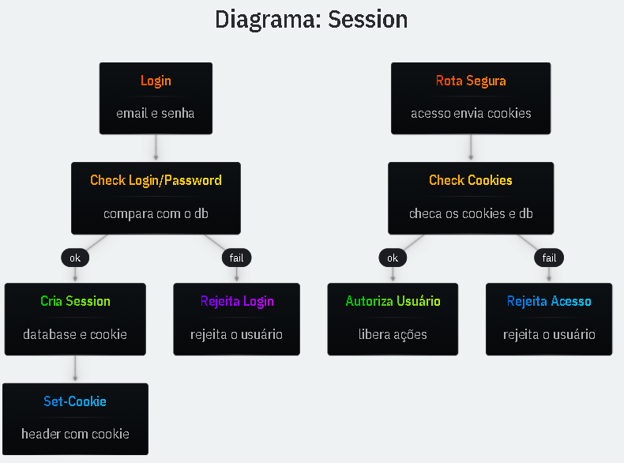

# Session

Quando o usuário efetua login no aplicativo, um cookie é enviado para o cliente com um identificador único.

- **Cookie**  
  O cookie é armazenado no browser, que é enviado em todas as requisições do usuário ao servidor.

- **Comparação**  
  Comparamos o cookie enviado com o definido no servidor para autenticar o usuário, sem precisar solicitar novamente o seu login/senha

```ts
// apenas um exemplo, NÃO é seguro.
core.router.get("/login", (req, res) => {
  const { email, password } = req.body;
  const user = this.db
    .query(
      /*sql*/
      `SELECT "id", "password_hash" FROM "users" WHERE "email" = ?`,
    )
    .get(email) as { password_hash: string; id: number } | undefined;
  if (!user || password !== user.password_hash) {
    throw new RouteError(404, "email ou senha incorretos");
  }
  res.setHeader("Set-Cookie", `sid=${user.id}; Path=/`);
  res.status(200).json({ title: "login efetuado" });
});

core.router.get("/seguro", async (req, res) => {
  const id = req.headers.cookie?.match(/sid=(\d+)/)?.[1];
  res.status(200).json({ autenticado: id });
});
```

## Diagrama Session



## Cliente Login

```html
<!DOCTYPE html>
<html lang="pt-br">
  <head>
    <meta charset="UTF-8" />
    <meta name="viewport" content="width=device-width, initial-scale=1.0" />
    <title>Tiny LMS</title>
  </head>
  <body>
    <style>
      * {
        box-sizing: border-box;
        font-family: monospace;
      }
      body {
        background: black;
        color: white;
        font-size: 1.125rem;
      }
      form,
      pre {
        margin: 0;
        max-width: 600px;
        padding: 1rem;
        margin: 0 auto;
        overflow: auto;
      }
      input,
      button {
        display: block;
        width: 100%;
        padding: 0.75rem;
        margin: 0.5rem 0 1rem 0;
        border-radius: 8px;
        color: white;
        border: 1px solid #222;
      }
      input {
        background: linear-gradient(
          to bottom,
          rgba(255, 255, 255, 0.05),
          rgba(255, 255, 255, 0.025)
        );
      }
      input:focus {
        outline: white;
        border-color: white;
      }
      button {
        background: linear-gradient(
          to bottom,
          rgba(255, 255, 255, 0.15),
          rgba(255, 255, 255, 0.05)
        );
        cursor: pointer;
      }
      button:hover {
        background: linear-gradient(
          to bottom,
          rgba(255, 255, 255, 0.2),
          rgba(255, 255, 255, 0.1)
        );
      }
    </style>

    <form id="login">
      <label for="email">Email</label>
      <input type="email" name="email" id="email" value="andre@origamid.com" />
      <label for="password">Senha</label>
      <input type="password" name="password" id="password" value="12345678" />
      <button>Logar</button>
    </form>

    <pre id="result"></pre>

    <script>
      const form = document.querySelector("#login");
      const result = document.querySelector("#result");

      form.addEventListener("submit", async (e) => {
        e.preventDefault();
        const data = new FormData(form);
        const response = await fetch("/auth/login", {
          method: "POST",
          headers: {
            "Content-Type": "application/json",
          },
          body: JSON.stringify(Object.fromEntries(data)),
        });
        const body = await response.json();
        result.innerText = JSON.stringify(body, null, 2);
        if (response.ok) {
          window.location.reload();
        }
      });

      async function autenticado() {
        const response = await fetch("/seguro");
        const body = await response.json();
        result.innerText = JSON.stringify(body, null, 2);
      }

      autenticado();
    </script>
  </body>
</html>
```
