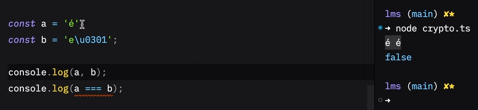
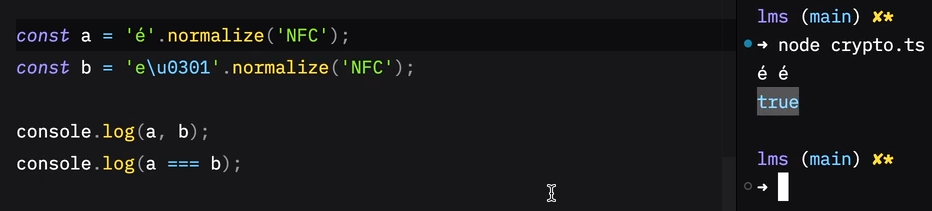
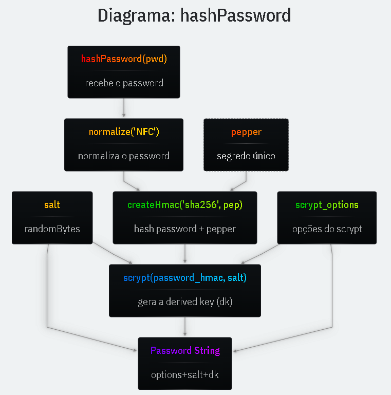
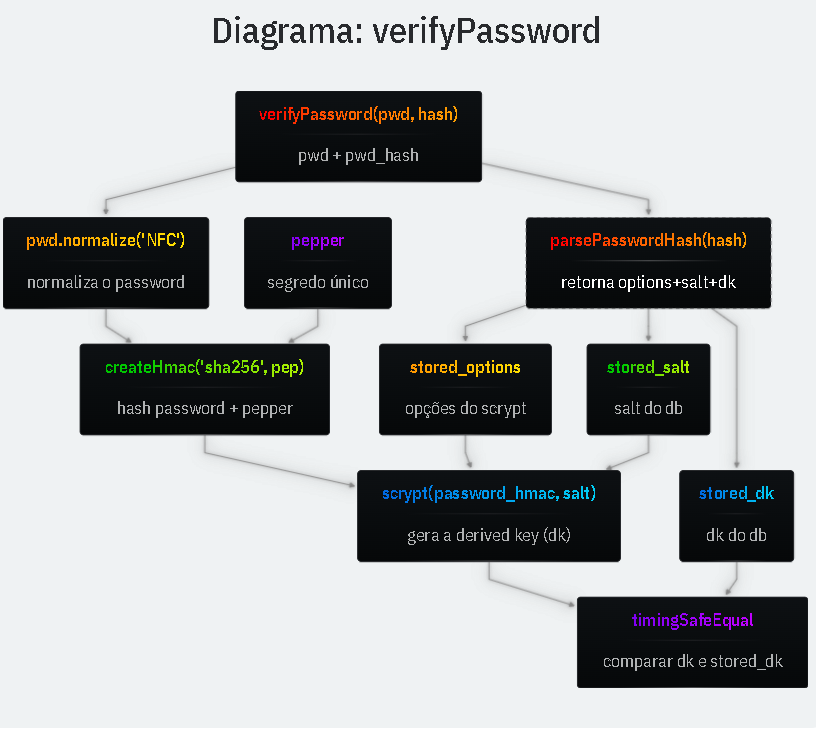

#

Assim como o sid da sessão, as senhas devem ser guardadas como hash no banco para que, em caso de vazamento, o atacante não obtenha as senhas em texto.

Como SHA256 é rápido, não serve para senha. Para senhas usamos um algoritmo lento para tornar ataques de força bruta inviáveis.

[Ver mais sobre o algoritimo Scrypt 🔍](https://www.tarsnap.com/scrypt/scrypt.pdf)

- `Scrypt`  
  Função lenta que usaremos para gerar o hash da senha. Existem outras como bcrypt, argon2 (argon2 é considerada a melhor, mas não é nativa do Node).

- `Salt`  
  Valor aleatório combinado à senha para que senhas idênticas resultem em hashes diferentes.

- `dkLen`  
  Tamanho da saída. 32 bytes (256 bits) é um bom padrão.

- `Parâmetros (N, r e p)`  
  Custo de CPU/memória.
  > **Qualquer mudança neles modifica o hash final**.

> Obs.: rainbow tables são tabelas de hashes de senhas comuns que podem ser utilizadas em ataques caso nosso bd seja vazado.

```ts
const SCRYPT_OPTIONS: ScryptOptions = {
  N: 2 ** 14, // uso de cpu/memoria. Potência de 2
  r: 8, // block-size
  p: 1, // iterações paralelas
};

const password = "P@ssw0rd";

const salt = await randomBytesAsync(16);

const dk = await scryptAsync(password, salt, 32, SCRYPT_OPTIONS);

const password_hash = `${salt.toString("hex")}$${dk.toString("hex")}`;
```

# HMAC

Para aumentar a segurança, adicionamos um segredo do servidor (pepper) à senha antes de derivar o hash com scrypt.

- `createHmac`  
  Recebe o algoritmo de hash como sha256 + um segredo (pepper).

- `update(pwd).digest()`  
  Recebe a senha e devolve bytes.

```ts
import { createHmac } from "node:crypto";

const password = "P@ssw0rd";

// mudar o pepper irá invalidar todos os passwords
const PEPPER = "segredo";

const password_hmac = createHmac("sha256", PEPPER).update(password).digest();
```

---

> para adicionar mais segurança a senha usaremos um HMAC para gerar um hash da senha enviada antes de gerar o hash final que irá para o banco de dados.

> curiosidade: salt (sal) = valor aleatório que será utilizado para criar hashes diferente, ainda que a senha passada seja a mesma, sem ele senhas iguais teriam o mesmo hash (o que é perigoso pois caso o bd seja vazado pode-se descrobrir senhas mais facilmente uma vez que hashes iguais implicam em senhas mais utilizadas, ou seja, senhas fracas) e pepper (pimenta) = representa um 'segredo' presente no servidor usado para criar o HMAC (hash do valor enviado na req antes do hash final que irá para o bd)

# ATENÇÃO! MUDAR O PEPPER IRÁ INVALIDAR TODOS OS PASSWORDS!

> pergunta, onde gurdar esses valores e parametros ultrassensíveis que não podem ser jamais modificados? (acredito que veremos isso quando formos tratar de variáveis de ambiente)

> com o HMAC se o bd vazar mas o segredo não será impossível mesmo com força bruta o atacante descobrir a senha final do usuário.

---

# normalize("NFC")

Irá normalizar caracteres que paressem iguais mas não são como: `é` e `e\u0301`. **Aplicar sempre antes no hash (HMAC)**.

```ts
const password_normalized = password.normalize("NFC");
const password_hmac = createHmac("sha256", PEPPER)
  .update(password_normalized)
  .digest();
```

> normalizamos sempre antes de criar o HMAC
> questão não de segurança mas de usabilidade (ex.: pessoas que usam gerenciadores de senhas)




---

# Verify Password (até esse ponto já estaria uma noa validação de hash e muito segura)

Precisamos verificar se a senha enviada no momento do login é a mesma utilizada para gerar a **password_string (hash armazenado no banco)**.

- `Parse String`  
  Primeiro, fazemos o parse da string armazenada no banco de dados para separar salt e DK.

- `Recriar a DK`  
  Recriamos a derived key (DK) com a senha enviada pelo usuário, usando o salt e as mesmas opções do scrypt.

- `timingSafeEqual`  
  Comparamos os buffers da DK gerada com a DK do banco de dados. timingSafeEqual garante comparação em tempo constante.

```ts
function parsePasswordHash(password_hash: string) {
  const parts = password_hash.split("$");
  const [stored_salt_hex, stored_dk_hex] = parts;
  const stored_salt = Buffer.from(stored_salt_hex, "hex");
  const stored_dk = Buffer.from(stored_dk_hex, "hex");
  return { stored_salt, stored_dk };
}

async function verifyPassword(password: string, password_hash: string) {
  const { stored_salt, stored_dk } = parsePasswordHash(password_hash);

  const password_normalized = password.normalize("NFC");
  const password_hmac = createHmac("sha256", PEPPER)
    .update(password_normalized)
    .digest();

  const dk = await scryptAsync(password_hmac, stored_salt, 32, SCRYPT_OPTIONS);

  if (dk.length !== stored_dk.length) return false;

  return timingSafeEqual(dk, stored_dk);
}
```

---

> timingSafeEqual gera uma comparação constante, mesmo quando falha ou é verdadeiro, o tempo de comparação é o mesmo, fazemos isso para evitar ataques que se utilizam do tempo que se leva para rejeitar uma senha (as que demoram masi a ser rejeitadas geralmente estarão mais próximas da senha real), com essa função o tempo de comparação permanence constante, evitando o sucesso desse tipo de ataque.

---

# Password String

O valor salvo no banco de dados deve incluir o hash gerado pelo scrypt e o salt utilizado. Também é útil registrar outras informações relevantes para a derivação, como o algoritmo e suas configurações.

> essa parte não é questão de segurança e sim para usabilidade do desenvolvedor. Não faremos o modelo de segurança 'caixa-preta'.

- **PHC** ([formato recomendado 📌](https://github.com/P-H-C/phc-string-format/blob/master/phc-sf-spec.md))
  - Usaremos um formato inspirado no formato recomendado pelo PHC (Password Hashing Competition).
    > curiosidade: o algoritimo argon foi gerado nessa competição.

- **Formato utilizado:** `<id>$<v>$<norm>$<N=,r=,p=>$<salt>$<dk>`
  - `<id>`: algoritmo utilizado;
  - `<v>`: versão do código;
  - `<norm>`: normalização usada na password;
  - `<N=,r=,p=>`: parametros/configurações do algoritmo;
  - `<salt>`: salt usado para gerar da senha hash;
  - `<dk>`: dk gerada;
    > Usamos o `$` para separar cada campo.

```ts
const NORM = "NFC";

async function hashPassword(password: string) {
  // ...
  return (
    `scrypt$v=1$norm=${NORM}$N=${SCRYPT_OPTIONS.N},r=${SCRYPT_OPTIONS.r},p=${SCRYPT_OPTIONS.p}` +
    `$${salt.toString("hex")}$${dk.toString("hex")}`
  );
}

function parsePasswordHash(password_hash: string) {
  const parts = password_hash.split("$");
  const [id, v, norm, options, stored_salt_hex, stored_dk_hex] = parts;
  const stored_salt = Buffer.from(stored_salt_hex, "hex");
  const stored_dk = Buffer.from(stored_dk_hex, "hex");
  const stored_norm = norm.replace("norm=", "");
  const stored_options = options.split(",").reduce((acc, kv) => {
    const [k, v] = kv.split("=", 2);
    acc[k] = Number(v);
    return acc;
  }, {});
  return { stored_salt, stored_dk, stored_options, stored_norm };
}
```

# Diagrama hashPassword



# Diagrama verifyPassword


