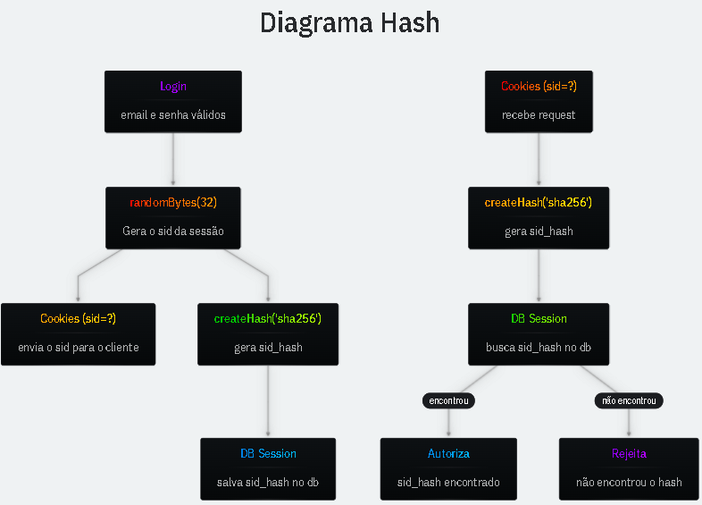

> salvamos o hash como buffer, o sqlite consegue indexar (BLOB);

# Session Hash

Se o `sid` (token de sessão) for salvo em texto no banco e esse banco vazar, um atacante pode usar os sid's para se autenticar. Por isso, **salvamos apenas o hash do sid no banco de dados**.

- **SHA-256**
  SHA (Secure Hashing Algorithm) - Algoritmo de hash criptográfico que produz 256 bits (32 bytes) de saída.

- **Mão Única**
  Funções de hash não são reversíveis. Não é possível recuperar a mensagem original a partir do hash. Para verificar, recalculamos o hash da mesma entrada e comparamos os resultados.

```ts
import { createHash } from "node:crypto";

const hash = createHash("sha256").update("123456").digest();

// 32 bytes. 32 * 8 (bits) = 256 bits
// Não importa o tamanho da mensagem, sempre terá 32 bytes
hash.length;
```

# createHash

**Função nativa do Node para gerar hash**.

- `createHash('sha256')`
  Tipo de algoritmo a ser utilizado, tem diversos como sha256, sha512 e outros.

- `.update('123456')`
  É no update que passamos a mensagem que será transformada.

- `.digest('base64url')`
  O digest irá gerar a mensagem final. Se não passarmos nada, ela é retornada como binário. Mas podemos também passar valores como 'hex', 'base64' e 'base64url' para retornar em formato de string.

```ts
import { createHash } from "node:crypto";

const binary = createHash("sha256").update("1").digest();
const base64url = createHash("sha256").update("1").digest("base64url");
```

# Diagram Hash


