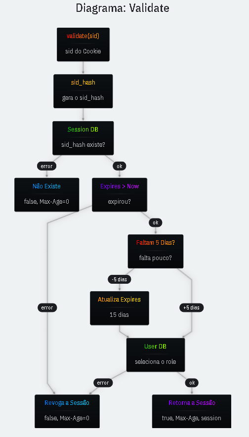

# Validate

A validação da rota deve checar além do sid, o tempo de expiração e as capacidades (role) do usuário.

> **É importante também indicar na resposta que a mesma não deve ser colocada em cache público**. (fazer isso para cada retorno sensível)

```ts
res.setHeader("Cache-Control", "private, no-store");

// A resposta é diferente de acordo com o Cookie
res.setHeader("Vary", "Cookie");
```

---

# Diagrama Validate


